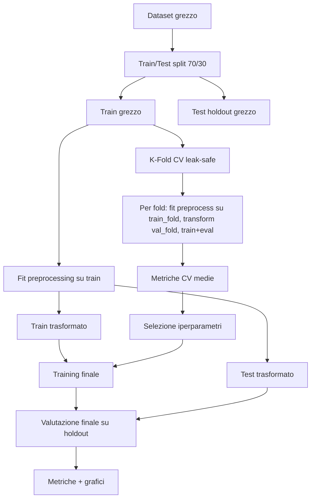

# Logistic Regression With Gradient Descend

Relazione tecnica del progetto di classificazione binaria sul dataset Wisconsin Breast Cancer.

Il repository confronta due approcci:
- implementazione custom di Logistic Regression ottimizzata con Gradient Descent;
- baseline con LogisticRegression di scikit-learn.

Obiettivo: valutare correttezza metodologica, capacità di generalizzazione e stabilità numerica, mantenendo un flusso sperimentale senza data leakage.

## 1. Obiettivi del lavoro

Gli obiettivi del progetto sono:
- implementare da zero un classificatore logistico binario;
- confrontarlo con una baseline consolidata (scikit-learn);
- utilizzare un protocollo di valutazione rigoroso (train/test holdout + cross-validation leak-safe);
- analizzare metriche e grafici diagnostici per discutere bias/varianza e trade-off tra errori clinicamente rilevanti.

## 2. Cenni teorici

### 2.1 Logistic Regression

Dato un campione $x \in \mathbb{R}^d$, il modello stima:

$$
p(y=1\mid x) = \sigma(z), \quad z = w^T x + b,
$$

dove $\sigma(z)=\frac{1}{1+e^{-z}}$ è la sigmoide.

La decisione di classe è ottenuta da una soglia (tipicamente 0.5).

### 2.2 Funzione obiettivo e regolarizzazione

La loss usata è la log-loss (cross-entropy):

$$
\mathcal{L}(w,b) = -\frac{1}{N} \sum_{i=1}^{N} \left[y_i\log(\hat{y}_i) + (1-y_i)\log(1-\hat{y}_i)\right] + \Omega(w)
$$

con termini opzionali:
- Ridge (L2): $\Omega(w)=\frac{\lambda}{2N}\|w\|_2^2$
- Lasso (L1): $\Omega(w)=\frac{\lambda}{N}\|w\|_1$

### 2.3 Gradient Descent

I parametri sono aggiornati iterativamente:

$$
w \leftarrow w - \eta \nabla_w \mathcal{L}, \qquad b \leftarrow b - \eta \nabla_b \mathcal{L}
$$

dove $\eta$ è il learning rate.

## 3. Dataset

- Fonte: UCI Wisconsin Breast Cancer (id=17, via ucimlrepo).
- Task: classificazione Benigno vs Maligno.
- Feature: variabili numeriche continue.

Caricamento e caching locale in [funzioni.py](funzioni.py) con salvataggio in [assets/dataset](assets/dataset).

## 4. Architettura del progetto

- [main.py](main.py): orchestrazione pipeline completa.
- [funzioni.py](funzioni.py): data loading, preprocessing leak-safe, tuning bayesiano, training helper.
- [logistic_regression_with_gradient_descend.py](logistic_regression_with_gradient_descend.py): implementazione custom.
- [validazione.py](validazione.py): k-fold CV leak-safe.
- [valutazione.py](valutazione.py): metriche di classificazione.
- [plot.py](plot.py): generazione grafici.

## 5. Scelte metodologiche

### 5.1 Protocollo anti-data leakage

La pipeline adotta esplicitamente un flusso leak-safe:
- split train/test su dati grezzi;
- fit del preprocessing solo su train;
- applicazione degli artefatti al test;
- cross-validation sul train grezzo con preprocessing rifittato in ogni fold.

Questo evita che statistiche del test (media, deviazione standard, feature eliminate, encoding) influenzino training o tuning.

### 5.2 Pipeline di preprocessing

Per ogni train (globale o fold):
- imputazione NaN con media del train;
- normalizzazione Z-score con media/std del train;
- eliminazione feature altamente correlate (soglia configurabile);
- encoding target;
- opzione bilanciamento classi (SMOTE/undersampling, quando richiesto).

### 5.3 Hyperparameter optimization

La ricerca usa ottimizzazione bayesiana (gp_minimize) su:
- learning_rate
- lambda_
- n_iterations
- regularization

Nota importante: l'obiettivo della ricerca ora rispetta lo scorer passato (es. MCC, FPR/FNR, precision, recall, AUC), e non è più fissato implicitamente su una singola metrica.

### 5.4 Inizializzazione dei pesi nel modello custom

Nel modello [LogisticRegressionGD](logistic_regression_with_gradient_descend.py) i pesi sono inizializzati con piccoli valori casuali centrati in zero (random_state fisso per riproducibilità), invece di valori grandi costanti.

Motivazione tecnica:
- valori iniziali troppo grandi saturano la sigmoide e possono rendere il gradiente poco informativo;
- una inizializzazione piccola mantiene il modello in una zona numericamente stabile nelle prime iterazioni;
- la riproducibilità del seed riduce la varianza tra run e rende confronti sperimentali più affidabili.

## 6. Pipeline sperimentale (schema)



## 7. Risultati dell'ultima esecuzione

Riferimenti file:
- iperparametri: [assets/best_parameters.json](assets/best_parameters.json)
- metriche CV: [assets/k_fold_metriche_definitivo.csv](assets/k_fold_metriche_definitivo.csv)
- metriche test: [assets/metriche_modelli_test_definitivo.csv](assets/metriche_modelli_test_definitivo.csv)

### 7.1 Migliori iperparametri trovati

- learning_rate: 0.007792297153882995
- lambda_: 0.00019949166150633933
- n_iterations: 5133
- regularization: ridge

### 7.2 Cross-validation (k=10)

| Modello | Accuracy | ROC AUC | F1 | Precision | Recall | MCC | FNR | FPR |
|---|---:|---:|---:|---:|---:|---:|---:|---:|
| LogisticRegressionGD | 0.979872 | 0.988048 | 0.971558 | 0.986058 | 0.958119 | 0.956320 | 0.041881 | 0.008194 |
| Scikit_learn | 0.977436 | 0.988390 | 0.965765 | 0.987083 | 0.947008 | 0.949853 | 0.052992 | 0.008000 |

### 7.3 Test holdout

| Modello | Accuracy | ROC AUC | F1 | Precision | Recall | MCC | FNR | FPR |
|---|---:|---:|---:|---:|---:|---:|---:|---:|
| LogisticRegressionGD | 0.976608 | 0.999124 | 0.967742 | 1.000000 | 0.937500 | 0.950640 | 0.062500 | 0.000000 |
| Scikit_learn | 0.976608 | 0.996495 | 0.967742 | 1.000000 | 0.937500 | 0.950640 | 0.062500 | 0.000000 |

Interpretazione sintetica:
- i due modelli sono sostanzialmente equivalenti sul test holdout;
- la versione custom è pienamente competitiva;
- la CV mostra un vantaggio leggero del custom in questa configurazione.

### 7.4 Ablation sul target di ottimizzazione (FNR vs MCC)

Per valutare la sensibilità del tuning al target, sono state eseguite due ottimizzazioni separate salvate in:
- [assets/FNR](assets/FNR)
- [assets/MCC](assets/MCC)

Risultati principali:
- i parametri ottimali cambiano tra i due target;
- il target MCC produce un miglioramento molto piccolo in cross-validation su alcune metriche aggregate;
- sul test holdout le differenze sono marginali, con metriche di classificazione praticamente sovrapponibili;
- l'effetto osservato è quantitativamente ridotto rispetto alla variabilità naturale del problema.

## 8. Analisi grafica

Learning curve:
- [Learning curve custom](assets/learning_curve_LogisticRegressionGD.png)
- [Learning curve scikit-learn](assets/learning_curve_Scikit_learn.png)

Curve ROC:
- [ROC custom](assets/ROC_curve_Modello%20LogisticRegressionGD.png)
- [ROC scikit-learn](assets/ROC_curve_Modello%20Scikit_learn.png)

Curve Precision-Recall:
- [PRC custom](assets/prc_auc_modello_LogisticRegressionGD.png)
- [PRC scikit-learn](assets/prc_auc_modello_Scikit_learn.png)

Confusion matrix:
- [Confusion matrix custom](assets/confusion_matrix_Modello%20LogisticRegressionGD.png)
- [Confusion matrix scikit-learn](assets/confusion_matrix_Modello%20Scikit_learn.png)

Confronti aggiuntivi:
- [Confronto metriche aggregato](assets/metrics_comparison.png)
- [Effetto regolarizzazione Ridge](assets/regularization_effect_ridge.png)
- [Effetto regolarizzazione Lasso](assets/regularization_effect_lasso.png)
- [Funzione sigmoide](assets/sigmoid_function.png)

## 9. Confronto con scikit-learn

Punti di confronto principali:
- prestazioni: comparabili su holdout, differenze contenute;
- robustezza: scikit-learn resta un benchmark forte per stabilità numerica e solvers ottimizzati;
- trasparenza: il modello custom consente piena ispezione di loss, traiettoria dei parametri e impatto della regolarizzazione;
- valore didattico: il custom facilita la comprensione diretta del comportamento della Logistic Regression.

## 10. Riproducibilità

Dipendenze principali:
- numpy
- pandas
- scikit-learn
- matplotlib
- seaborn
- imbalanced-learn
- scikit-optimize
- ucimlrepo

Esecuzione:

```bash
uv run python main.py
```

Per salvare il log completo:

```bash
uv run python main.py > log.txt 2>&1
```

## 11. Conclusioni

Il progetto dimostra che una implementazione custom di Logistic Regression con Gradient Descent, se progettata con pipeline leak-safe e tuning corretto, può raggiungere performance allineate a una baseline industriale.

Il contributo principale è duplice:
- tecnico-metodologico (valutazione rigorosa senza leakage);
- formativo (comprensione approfondita del modello oltre l'uso black-box della libreria).